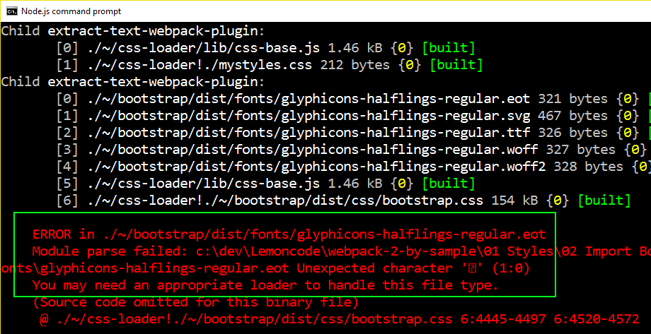
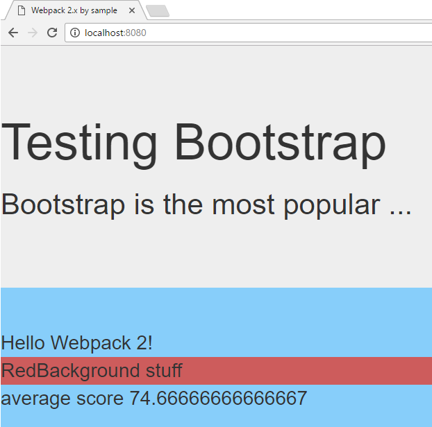

# 02 Import Bootstrap

In this demo we will install and configure webpack to import the well known
[Bootstrap](https://getbootstrap.com/) css library.

We will start from sample _01 Styles/01 Custom CSS_.

Summary steps:
 - Install bootstrap.
 - Import the css library.
 - Use a jumbotron element from bootstrap in our HTML.
 - Check that we get errors when running webpack.
 - Install additional loaders in order to manage fonts and other
 files required by Bootstrap.
 - Check results.

# Steps to build it

## Prerequisites

Prerequisites, you will need to have nodejs installed in your computer. If you want to follow this step guides you will need to take as starting point sample _01 Custom CSS_.

## steps

- `npm install` to install previous sample packages:

```
npm install
```

- Let's start by installing Bootstrap:

```
npm install bootstrap --save
```

- Let's import the CSS library in order to include it in our project:

### ./webpack.config.js
```diff
...

module.exports = {
  entry: {
    app: './students.js',
    appStyles: [
      './mystyles.css',
    ],
    vendor: [
      'jquery',
    ],
+   vendorStyles: [
+     './node_modules/bootstrap/dist/css/bootstrap.css',
+   ],
  },
  ...
};

```

- Since we are going to dig into *node_modules*, on the CSS loader section, let's remove the node_modules ignore:

### ./webpack.config.js
```diff
...

module.exports = {
  ...
  module: {
    rules: [
      {
        test: /\.js$/,
        exclude: /node_modules/,
        loader: 'babel-loader',
      },
      {
        test: /\.css$/,
-       exclude: /node_modules/,
        loader: ExtractTextPlugin.extract({
          fallback: 'style-loader',
          use: {
            loader: 'css-loader',
          },
        }),
      },
    ],
  },
  ...
};

```

- Let's modify our *index.html* and include some specific Bootstrap component:

### ./index.html
```diff
<!DOCTYPE html>
<html lang="en">
  <head>
    <meta charset="utf-8">
    <meta http-equiv="X-UA-Compatible" content="IE=edge">
    <meta name="viewport" content="width=device-width, initial-scale=1">
    <title>Webpack 2.x by sample</title>
  </head>
  <body>
+   <div class="jumbotron">
+     <h1>Testing Bootstrap</h1>
+     <p>
+       Bootstrap is the most popular ...
+     </p>
+   </div>
    Hello Webpack 2!
    <div class="red-background ">
      RedBackground stuff
    </div>
  </body>
</html>

```

- If we try to run webpack now we will get errors. Webpack is complaining that it's not able to process fonts that are being used by Bootstrap thus we need to set a font appropriate loader:



- Let's set up the appropriate font / glyphicon loaders. We will install first [file-loader](https://github.com/webpack/file-loader). It will produce a new file into our build directory (*/dist*) and return the public url.

```
npm install file-loader --save-dev
```

- Producing all the files (images, fonts) in separate files is something we are used to, but what happens if we have a lot of small files? Initial load of the page would be slower requesting a big bunch of small files. Another option that we have is to use [url-loader](https://github.com/webpack/url-loader), in this case the files are encoded as data inside the HTML... and we can combine *file-loader* / *url-loader* by adding a condition, encode only files that are smaller than a given size.

```
npm install url-loader --save-dev
```

- Now let's include these loaders in *webpack.config.js*:

### ./webpack.config.js
```diff
...

module.exports = {
  ...
  module: {
    rules: [
      {
        test: /\.js$/,
        exclude: /node_modules/,
        loader: 'babel-loader',
      },
      {
        test: /\.css$/,
        loader: ExtractTextPlugin.extract({
          fallback: 'style-loader',
          use: {
            loader: 'css-loader',
          },
        }),
      },
+     // Loading glyphicons => https://github.com/gowravshekar/bootstrap-webpack
+     // Using here url-loader and file-loader
+     {
+       test: /\.(woff|woff2)(\?v=\d+\.\d+\.\d+)?$/,
+       loader: 'url-loader?limit=10000&mimetype=application/font-woff'
+     },
+     {
+       test: /\.ttf(\?v=\d+\.\d+\.\d+)?$/,
+       loader: 'url-loader?limit=10000&mimetype=application/octet-stream'
+     },
+     {
+       test: /\.eot(\?v=\d+\.\d+\.\d+)?$/,
+       loader: 'file-loader'
+     },
+     {
+       test: /\.svg(\?v=\d+\.\d+\.\d+)?$/,
+       loader: 'url-loader?limit=10000&mimetype=image/svg+xml'
+     },
    ],
  },
...
};

```

- Let's launch the application (`npm start`) and check that our page is being displayed
using Bootstrap styles (see [Bootstrap's jumbotron](https://getbootstrap.com/components/#jumbotron)).


