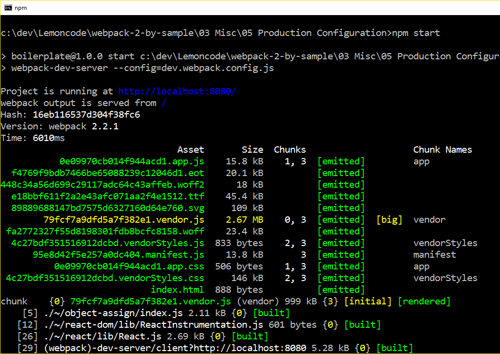
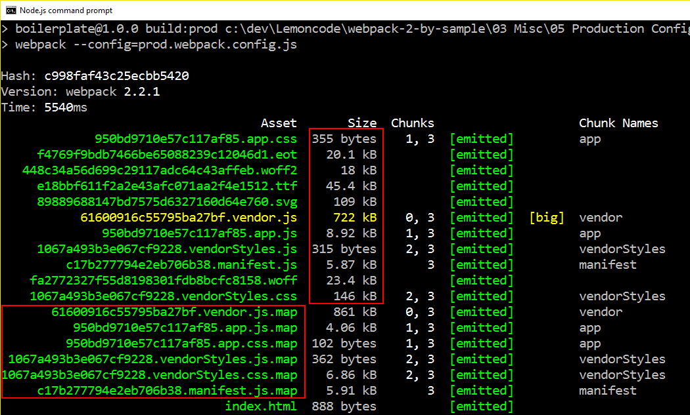
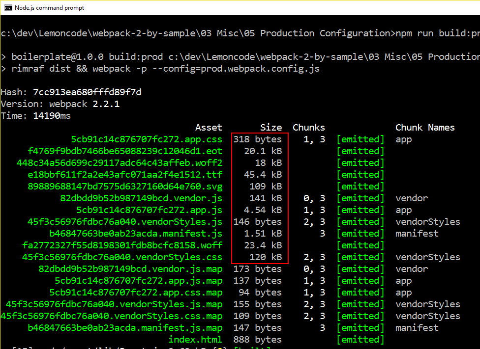

# 05 Production Configuration

In this demo we are going to create different builds for each environment.
We will learn how to configure it and how to reduce bundle file sizes.

We will start from sample _03 Misc/04 CSS Modules_.

Summary steps:
- Add base webpack config file
- Add webpack-merge package.
- Install rimraf to clean dist folder.
- Add development config file.
- Add production config file.
- Add cross-env package to create environment variables.

# Steps to build it

## Prerequisites

Prerequisites, you will need to have nodejs installed in your computer. If you want to follow this step guides you will need to take as starting point sample _04 CSS Modules_.

## steps

- `npm install` to install previous sample packages:

```
npm install
```

- We are going to start with creating a base webpack configuration file where we are going to add the common features for both environments (`dev` and `prod`). One of the feature which we are split between environments is `sourcemaps`. [Webpack recommends](https://webpack.js.org/guides/production-build/#source-maps) that we enable source maps for `production` environment, due to are useful for debugging and to run benchmark tests. That's why they recommend use for example `cheap-module-source-map` for production.

- Let's go to rename `webpack.config.js` to `base.webpack.config.js`:

### ./base.webpack.config.js
```diff
var path = require('path');
var HtmlWebpackPlugin = require('html-webpack-plugin');
var webpack = require('webpack');
var ExtractTextPlugin = require('extract-text-webpack-plugin');

var basePath = __dirname;

module.exports = {
  context: path.join(basePath, 'src'),
  resolve: {
    extensions: ['.js', '.jsx', '.scss'],
  },
  entry: {
    app: './students.jsx',
    vendor: [
      'react',
      'react-dom',
    ],
    vendorStyles: [
      '../node_modules/bootstrap/dist/css/bootstrap.css',
    ],
  },
  output: {
    path: path.join(basePath, 'dist'),
    filename: '[chunkhash].[name].js',
  },
  module: {
    rules: [
      {
        test: /\.jsx?$/,
        exclude: /node_modules/,
        loader: 'babel-loader',
      },
      {
        test: /\.scss$/,
        exclude: /node_modules/,
        loader: ExtractTextPlugin.extract({
          fallback: 'style-loader',
          use: [
            {
              loader: 'css-loader',
              options: {
                modules: true,
                localIdentName: '[name]__[local]___[hash:base64:5]',
                camelCase: true,
              },
            },
            { loader: 'sass-loader', },
          ],
        }),
      },
      {
        test: /\.css$/,
        include: /node_modules/,
        loader: ExtractTextPlugin.extract({
          fallback: 'style-loader',
          use: {
            loader: 'css-loader',
          },
        }),
      },
      // Loading glyphicons => https://github.com/gowravshekar/bootstrap-webpack
      // Using here url-loader and file-loader
      {
        test: /\.(woff|woff2)(\?v=\d+\.\d+\.\d+)?$/,
        loader: 'url-loader?limit=10000&mimetype=application/font-woff'
      },
      {
        test: /\.ttf(\?v=\d+\.\d+\.\d+)?$/,
        loader: 'url-loader?limit=10000&mimetype=application/octet-stream'
      },
      {
        test: /\.eot(\?v=\d+\.\d+\.\d+)?$/,
        loader: 'file-loader'
      },
      {
        test: /\.svg(\?v=\d+\.\d+\.\d+)?$/,
        loader: 'url-loader?limit=10000&mimetype=image/svg+xml'
      },
    ],
  },
- // For development https://webpack.js.org/configuration/devtool/#for-development
- devtool: 'inline-source-map',
  devServer: {
    port: 8080,
  },
  plugins: [
    //Generate index.html in /dist => https://github.com/ampedandwired/html-webpack-plugin
    new HtmlWebpackPlugin({
      filename: 'index.html', //Name of file in ./dist/
      template: 'index.html', //Name of template in ./src
			hash: true,
    }),
    new webpack.ProvidePlugin({
      $: "jquery",
      jQuery: "jquery"
    }),
    new webpack.optimize.CommonsChunkPlugin({
      names: ['vendor', 'manifest'],
    }),
    new ExtractTextPlugin({
      filename: '[chunkhash].[name].css',
      disable: false,
      allChunks: true,
    }),
  ],
};

```

- To avoid each time we run build delete the dist folder manually, we are going to install a package that does it for us:

```
npm install rimraf --save-dev
```


- Now it's time to install `webpack-merge` package. This allow us to combine `base.webpack.config` with environment config:

```
npm install webpack-merge --save-dev
```

- Let's go to create the `dev` environment configuration:

### ./dev.webpack.config.js
```javascript
var webpackMerge = require('webpack-merge');
var commonConfig = require('./base.webpack.config.js');

module.exports = function () {
  return webpackMerge(commonConfig, {
    // For development https://webpack.js.org/configuration/devtool/#for-development
    devtool: 'inline-source-map',
  });
}

```

- Finally we need to update command script:

### ./package.json
```diff
{
  ...
  "scripts": {
-   "start": "webpack-dev-server"
+   "start": "webpack-dev-server --config=dev.webpack.config.js"
  },
  ...
}

```

- Running `npm start`:



- We are going to create a `build dev` command to see how much size has bundles files without `webpack-dev-server` stuff:

### ./package.json
```diff
{
  ...
  "scripts": {
-   "start": "webpack-dev-server --config=dev.webpack.config.js"
+   "start": "webpack-dev-server --config=dev.webpack.config.js",
+   "build:dev": "rimraf dist && webpack --config=dev.webpack.config.js"
  },
  ...
}

```

- Running `npm run build:dev`, we can see how vendor bundle size decrease:


- Let's configure `production` environment:

### ./prod.webpack.config.js
```javascript
var webpackMerge = require('webpack-merge');
var commonConfig = require('./base.webpack.config.js');

module.exports = function () {
  return webpackMerge(commonConfig, {
    devtool: 'cheap-module-source-map',
  });
}

```

- Add production command script:

### ./package.json
```diff
{
  ...
  "scripts": {
    "start": "webpack-dev-server --config=dev.webpack.config.js",
-   "build:dev": "rimraf dist && webpack --config=dev.webpack.config.js"
+   "build:dev": "rimraf dist && webpack --config=dev.webpack.config.js",
+   "build:prod": "rimraf dist && webpack --config=prod.webpack.config.js"
  },
  ...
}

```

- Running `npm run build:prod`, we can see how all bundle sizes decrease and map files appears:



- But we need one step over to decrease bundle size. We need to minify and uglify our bundles. To do this, we only need to active `p` flag:

### ./package.json
```diff
{
  ...
  "scripts": {
    "start": "webpack-dev-server --config=dev.webpack.config.js",
    "build:dev": "rimraf dist && webpack --config=dev.webpack.config.js",
-   "build:prod": "rimraf dist && webpack --config=prod.webpack.config.js"
+   "build:prod": "rimraf dist && webpack -p --config=prod.webpack.config.js"
  },
  ...
}

```

- Running `npm run build:prod`, we can see how bundle sizes decrease considerably:



### ./dist/...app.js
```diff
webpackJsonp([1,3],{171:function(e,t,n){"use strict";function r(e){if(e&&e.__esModule)return e;var t={};if(null!=e)for(var n in e)Object.prototype.hasOwnProperty.call(e,n)&&(t[n]=e[n]);return t.default=e,t}var o=n(18),u=r(o),a=n(29),c=r(a),l=n(79),i=n(80);c.render(u.createElement("div",null,u.createElement("h1",null,"Hello from React DOM"),u.createElement(l.AverageComponent,null),u.createElement(i.TotalScoreComponent,null)),document.getElementById("root"))},49:function(e,t,n){"use strict";function r(e){return o(e)/e.length}function o(e){return e.reduce(function(e,t){return
  ...
```

### ./dist/..app.css
```diff
.averageComponentStyles__result-background___Z3Vf0{background-color:teal}.jumbotron.averageComponentStyles__result-background___Z3Vf0{background-color:#8fbc8f!important;display:block}.totalScoreComponentStyles__result-background___3eH-g{background-color:#cd5c5c}
/*# sourceMappingURL=5cb91c14c876707fc272.app.css.map*/

```
