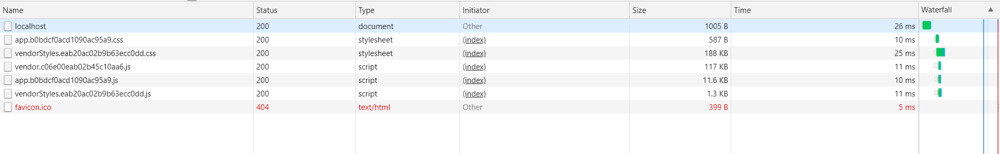
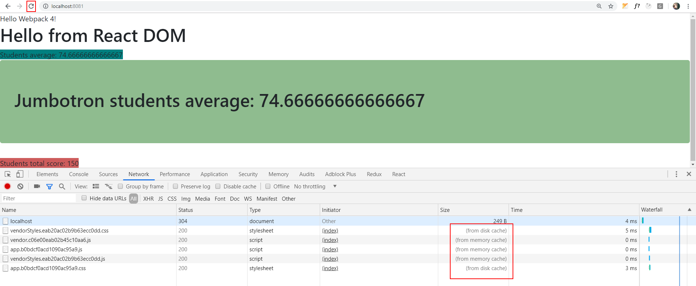
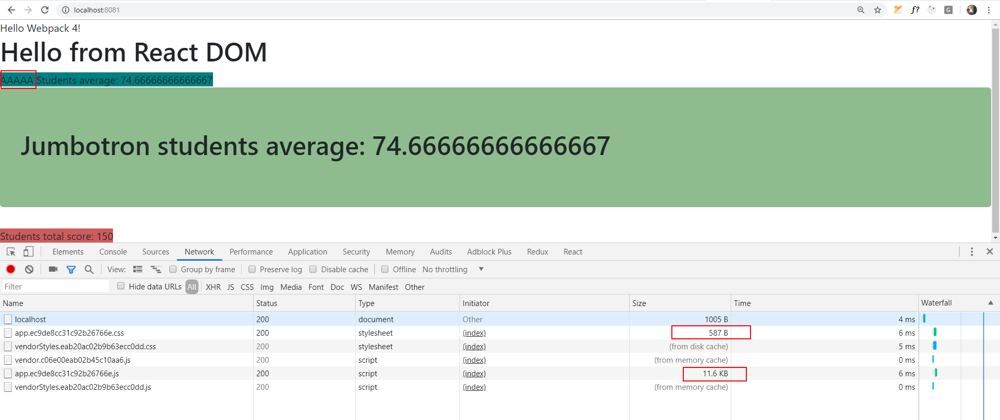

# 04 Production Configuration

In this demo we are going to create different builds for each environment.
We will learn how to configure it and how to reduce bundle file sizes.

We will start from sample _03 Environments/03 HMR_.

Summary steps:

- Add base webpack config file
- Add webpack-merge package.
- Add development config file.
- Add production config file.

# Steps to build it

## Prerequisites

Prerequisites, you will need to have nodejs installed in your computer. If you want to follow this step guides you will need to take as starting point sample _03 hmr_.

## steps

- `npm install` to install previous sample packages:

```
npm install
```

- We will start by creating base webpack configuration that will hold all the common feature for both environments (dev and prod). Then we will place specific configuration for dev and production in their config files (e.g. sourcemaps). Webpack, recommends enabling sources maps for development environment (debuggging purposes), but disable it for normal use.

- Let's rename `webpack.config.js` to `base.webpack.config.js`. We will update it when we will have `dev` and `prod` config.

- Now it's time to install `webpack-merge` package. This allow us to combine `base.webpack.config` with dev or production specific config settings:

```
npm install webpack-merge --save-dev
```

- Let's create the `dev` environment configuration:

_./dev.webpack.config.js_

```javascript
const merge = require('webpack-merge');
const base = require('./base.webpack.config.js');

module.exports = merge(base, {
  mode: 'development',
  resolve: {
    alias: {
      'react-dom': '@hot-loader/react-dom',
    },
  },
  output: {
    filename: '[name].js',
  },
  module: {
    rules: [
      {
        test: /\.scss$/,
        exclude: /node_modules/,
        use: [
          'style-loader',
          {
            loader: 'css-loader',
            options: {
              modules: {
                localIdentName: '[name]__[local]__[hash:base64:5]',
              },
              localsConvention: 'camelCase',
            },
          },
          {
            loader: 'sass-loader',
            options: {
              implementation: require('sass'),
            },
          },
        ],
      },
      {
        test: /\.css$/,
        use: ['style-loader', 'css-loader'],
      },
    ],
  },
  devtool: 'inline-source-map',
  devServer: {
    hot: true,
  },
});

```

- Just to make a quick check we will add console log, to check in which environment we are running the app (dev or production):

### ./averageService.ts

```diff
export function getTotalScore(scores: number[]): number {
  return scores.reduce((score, count) => score + count);
}

export function getAvg(scores: number[]): number {
  return getTotalScore(scores) / scores.length;
}


+ console.log(`We are in: ${process.env.NODE_ENV}`);
```

- Remove unnecessary configuration from `base`:

_./base.webpack.config.js_

```diff
const HtmlWebpackPlugin = require('html-webpack-plugin');
const webpack = require('webpack');
const path = require('path');
const basePath = __dirname;

module.exports = {
  context: path.join(basePath, 'src'),
  resolve: {
    extensions: ['.js', '.jsx', '.ts', '.tsx'],
-   alias: {
-     'react-dom': '@hot-loader/react-dom',
-   },
  },
  ...
- output: {
-   filename: '[name].js',
- },
  module: {
    rules: [
      ...
-     {
-       test: /\.scss$/,
-       exclude: /node_modules/,
-       use: [
-         'style-loader',
-         {
-           loader: 'css-loader',
-           options: {
-             modules: {
-               localIdentName: '[name]__[local]__[hash:base64:5]',
-             },
-             localsConvention: 'camelCase',
-           },
-         },
-         {
-           loader: 'sass-loader',
-           options: {
-             implementation: require('sass'),
-           },
-         },
-       ],
-     },
-     {
-       test: /\.css$/,
-       use: ['style-loader', 'css-loader'],
-     },
      ...
    ],
  },
  ...
- devtool: 'inline-source-map',
- devServer: {
-   hot: true,
- },
};

```

- Finally we need to update command script:

### ./package.json

```diff
{
  ...
  "scripts": {
-   "start": "webpack-dev-server --mode development --open",
+   "start": "webpack-dev-server --mode development --open --config dev.webpack.config.js",
    "build": "rimraf dist && webpack --mode development"
  },
  ...
}
```

- Running `npm start`:

We can see in console `We are in: development`

- We are going to create a `build dev` command to see how much size has bundles files without `webpack-dev-server` stuff:

### ./package.json

```diff
{
  ...
  "scripts": {
    "start": "webpack-dev-server --mode development --open --config dev.webpack.config.js",
-   "build": "rimraf dist && webpack --mode development"
+   "build:dev": "rimraf dist && webpack --config dev.webpack.config.js"
  },
  ...
}

```

- Running `npm run build`:

The `dist` folder is created. If we execute `index.html`, it shows us `We are in: development`.

- Let's configure the `production` environment:

_./prod.webpack.config.js_

```javascript
const merge = require('webpack-merge');
const base = require('./base.webpack.config.js');
const MiniCssExtractPlugin = require('mini-css-extract-plugin');

module.exports = merge(base, {
  mode: 'production',
  output: {
    filename: '[name].[chunkhash].js',
  },
  module: {
    rules: [
      {
        test: /\.scss$/,
        exclude: /node_modules/,
        use: [
          MiniCssExtractPlugin.loader,
          {
            loader: 'css-loader',
            options: {
              modules: {
                localIdentName: '[name]__[local]__[hash:base64:5]',
              },
              localsConvention: 'camelCase',
            },
          },
          {
            loader: 'sass-loader',
            options: {
              implementation: require('sass'),
            },
          },
        ],
      },
      {
        test: /\.css$/,
        use: [MiniCssExtractPlugin.loader, 'css-loader'],
      },
    ],
  },
  plugins: [
    new MiniCssExtractPlugin({
      filename: '[name].[chunkhash].css',
      chunkFilename: '[id].css',
    }),
  ],
});

```

- Let's add a production command script:

### ./package.json

```diff
{
  ...
  "scripts": {
    "start": "webpack-dev-server --mode development --open --config dev.webpack.config.js",
-   "build:dev": "rimraf dist && webpack --config dev.webpack.config.js"
+   "build:dev": "rimraf dist && webpack --config dev.webpack.config.js",
+   "build:prod": "rimraf dist && webpack --config prod.webpack.config.js"
  },
  ...
}

```

- If we run `npm run build:prod`, the following output will be dumped into the console log `We are in: production` and we can check that all bundle sizes decrease:

`npm run build`

```
  app.js          =>    46 KB
  app.css         =>     2 KB
  index.html      =>     1 KB
  vendor.js       =>  2060 KB
  vendor.css      =>   462 KB
  vendorStyles.js =>    15 KB

```

`npm run build:prod`

```
  0.css           => 170 KB
  app.js          =>  12 KB
  app.css         =>   1 KB
  index.html      =>   1 KB
  vendor.css      => 108 KB
  vendorStyles.js =>   2 KB

```

- Just as an optional extra step, we could generated the gzipped bundles (usually this is just handled by the web servers but is a good idea to generate this files in order to check the size). We need to install [compression-webpack-plugin](https://github.com/webpack-contrib/compression-webpack-plugin):

```
npm install compression-webpack-plugin --save-dev
```

- Let's update `prod.webpack.config`:

_./prod.webpack.config.js_

```diff
const merge = require('webpack-merge');
const base = require('./base.webpack.config.js');
const MiniCssExtractPlugin = require('mini-css-extract-plugin');
+ const CompressionPlugin = require('compression-webpack-plugin');

module.exports = merge(base, {
...

  },
  plugins: [
    new MiniCssExtractPlugin({
      filename: '[name].css',
      chunkFilename: '[id].css',
    }),
+   new CompressionPlugin({
+     filename: '[path].gz[query]',
+     algorithm: 'gzip',
+     test: /\.js$|\.jsx$|\.scss$|\.css$|\.html$/,
+     threshold: 1024,
+     minRatio: 0.8
+   }),
  ],
});

```

> _filename: [file] is replaced with the original asset filename. [path] is replaced with the path of the original asset. [query] is replaced with the query._

> _algorithm: The compression algorithm/function._

> _test: Test to match files against._

> _threshold: Only assets bigger than this size are processed. In bytes._

> _minRatio: Only assets that compress better that this ratio are processed. Defaults to 0.8._

- Running `npm run build:prod` with `CompressionPlugin`, we can see `.gz` files that we can upload to server. This is an optional configuration because it needs an extra configuration in server side:

```
  0.css              => 170 KB
  0.css.gz           =>  23 KB
  app.js             =>  12 KB
  app.js.gz          =>   3 KB
  app.css            =>   1 KB
  index.html         =>   1 KB
  vendor.css         => 108 KB
  vendor.css.gz      =>  35 KB
  vendorStyles.js    =>   2 KB
  vendorStyles.js.gz =>   1 KB

```

- If we finally configure the `deleteOriginalAssets` property, we delete the original assets.

_./prod.webpack.config.js_

```diff
...
  plugins: [
    new MiniCssExtractPlugin({
      filename: '[name].[chunkhash].css',
      chunkFilename: '[id].css',
    }),
    new CompressionPlugin({
      filename: '[path].gz[query]',
      algorithm: 'gzip',
      test: /\.js$|\.jsx$|\.scss$|\.css$|\.html$/,
      threshold: 1024,
      minRatio: 0.8,
+     deleteOriginalAssets: true
    }),
  ],
...

```

- Running `npm run build:prod`, the files in the `dist` folder are:

```
  0.css.gz           =>  23 KB
  app.js.gz          =>   3 KB
  app.css            =>   1 KB
  index.html         =>   1 KB
  vendor.css.gz      =>  35 KB
  vendorStyles.js.gz =>   1 KB

```

## Appendix - Server for production build

- If we want to create a basic `web server` for `static files`, we could use `nodejs` and `express`:

```bash
npm install express --save
```

- A basic express server configuration:

_./server/index.js_

```javascript
const express = require('express');
const path = require('path');

const port = 8081;
const app = express();
const distPath = path.resolve(__dirname, '../dist');

app.use(
  express.static(distPath, {
    maxAge: '1y',
  })
);
app.listen(port, function() {
  console.log('Server running on port ' + port);
});

```

> NOTE: [express static options](https://github.com/expressjs/serve-static)

- Update `npm` scripts:

_./package.json_

```diff
{
  ...
  "scripts": {
-   "start": "webpack-dev-server --mode development --open --config dev.webpack.config.js",
+   "start:dev": "webpack-dev-server --mode development --open --config dev.webpack.config.js",
+   "start:prod": "node ./server",
    ...
  },
  ...
}
```

- To keep working, first we are going to disable the `deleteOriginalAssets` compression plugin flag:

_./prod.webpack.config.js_

```diff
...
    new CompressionPlugin({
      filename: '[path].gz[query]',
      algorithm: 'gzip',
      test: /\.js$|\.jsx$|\.scss$|\.css$|\.html$/,
      threshold: 1024,
      minRatio: 0.8,
-     deleteOriginalAssets: true,
    }),
```

- We need to `build` our app as production first:

```bash
npm run build:prod  
```

- And now, run the app:

```bash
npm run start:prod
```





- If we made some changes in our app:

_./src/averageComponent.tsx_

```diff
...

      <div>
      <span className={classes.resultBackground}>
-       Students average: {average}
+       Students average: {average} AAAAAA
      </span>
      <div className={`jumbotron ${classes.resultBackground}`}>
        <h1>Jumbotron students average: {average}</h1>
      </div>
    </div>
...
```

- And run build again:

```bash
npm run build:prod  
```



- Using gzipped static files:

```bash
npm install express-static-gzip --save
```

_./server/index.js_

```diff
const express = require('express');
+ const expressStaticGzip = require('express-static-gzip');
...

app.use(
- express.static(distPath, {
+ expressStaticGzip(distPath, {
    maxAge: '1y',
  })
);
...

```

- Or gzip files in server, we have to install [compression](https://github.com/expressjs/compression) from express team:

```bash
npm install compression --save
```

- And use it in `server`:

### ./server/index.js

```diff
const express = require('express');
- const expressStaticGzip = require('express-static-gzip');
+ const compression = require('compression');
...

+ app.use(compression());
app.use(
- expressStaticGzip(distPath, {
+ express.static(distPath, {
    maxAge: '1y',
  })
);
...

```

- Run the app:

```bash
npm run start:prod
```

> NOTE: CTRL + F5 to refresh cache


