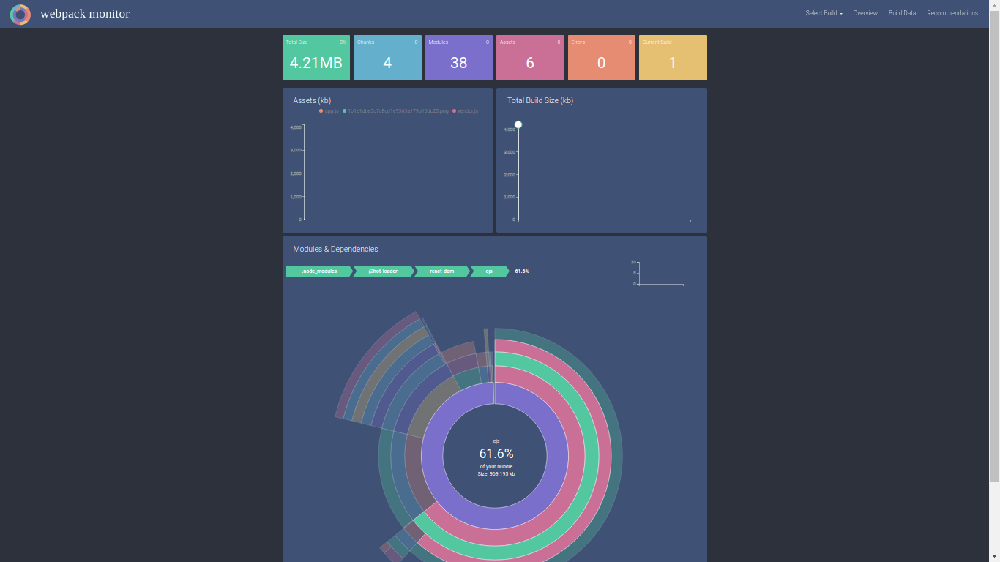

# 07 Webpack Monitor

In this demo we are going to install and configure the [Webpack Monitor](http://webpackmonitor.com/) plugin which captures relevant statistics on our builds and provide an interactive analysis tool of bundle composition.

We will start from sample _03 Environments/06 Bundle Analyzer_

Summary steps:

- Install the plugin.
- Add the plugin to the webpack config file required.

# Steps to build it

## Prerequisites

Prerequisites, you will need to have nodejs installed in your computer. If you want to follow this step guides you will need to take as starting point sample _06 Bundle Analyzer_

## Steps

- `npm install` to install previous sample packages:

```
npm install
```

- Let's go with the plugin installation:

```
npm install webpack-monitor --save-dev

```

- Add the plugin to our _dev.webpack.config.js_:

  1.- Create the following variable:

_./dev.webpack.config.js_

```diff
const merge = require('webpack-merge');
const base = require('./base.webpack.config.js');
const Dotenv = require('dotenv-webpack');
+ const WebpackMonitor = require('webpack-monitor');
```

2.- Add the following entry into the plugins array:

_./dev.webpack.config.js_

```diff
  plugins: [
    new Dotenv({
      path: './dev.env',
    }),
+    new WebpackMonitor({
+      capture: true, // -> default 'true'
+      target: '../monitor/myStatsStore.json', // default -> '../monitor/stats.json'
+      launch: true, // -> default 'false'
+      port: 3030, // default -> 8081
+    }),
  ],
```

- Parameters explanation:

```
- "capture" will collect stats on the build where meaningful changes have occured. The plugin do not capture build data where the build does not differ from most recent build on file. Its default value is "true".

- "target" specify where to save your build data. Its default value is "../monitor/stats.json".

- "launch" will fire up a local server and launch the webpack monitor analysis tool. Its default value is "false".

- "port" optionally set the port for local server. Its default value is "8081".

```

- Now we can see our Webpack Monitor plugin working! Simply execute the command `npm run build:dev`
  Depending on your machine, it could takes a while for the plugin to show up on your browser. Be patient!


